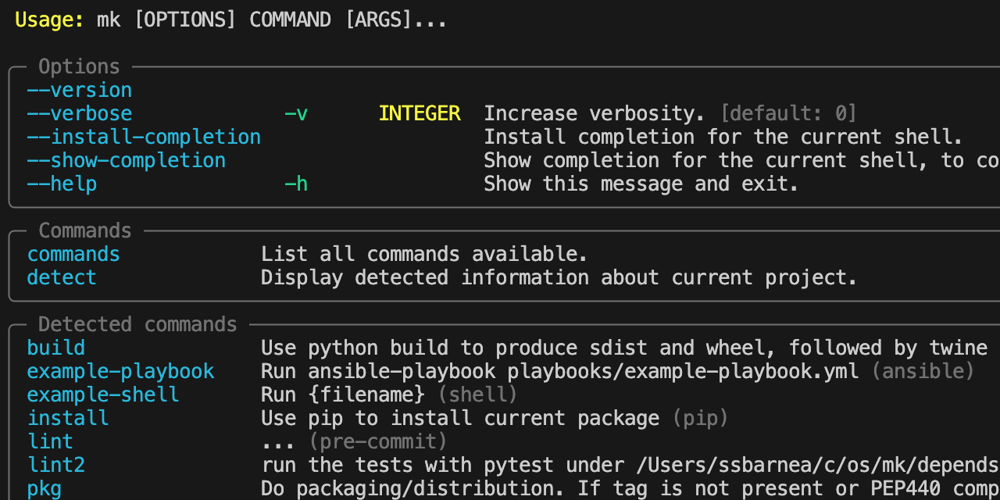

# Documentation of mk tool

`mk` is a CLI tool that aims to ease contribution to any open-source project by
hiding repository implementation details from the casual contributor. With it,
you can contribute without having to know all the build and testing tools that
the project team already uses, which often have strange requirements.



If you ever asked yourself one of the below questions, probably you would want
to try `mk` and if it can help you

- How do I run tests locally?
- Which are the test suites I can run?
- Is my change ready to be reviewed?
- How can I propose a change for review?

Run `mk` inside any cloned repository to display which options you have. No
configuration file is needed as the tool will look for common tools used by the
repository and expose their commands.

`mk` is inspired by tools as [make](make), [waf](waf), [taskfile](taskfile),
[tox](tox), [npm](npm), [yarn](yarn) and [pre-commit](pre-commit), but **it does
not aim to replace them**. Instead, it aims to provide a unified interface for
calling them that is friendly even for those that never used these tools.

## Installation

We recommend using [`pipx`](https://pipxproject.github.io/pipx/) to install `mk`
to avoid potential dependency conflicts. You can use `pip3 install --user mk` as
well.

```shell
pipx install mk
```

## How it works

`mk` inspects the current core repository and detects build tools used by the
project, like pre-commit, tox, npm and exposes their commands to the user in a
**predictable** way.

For example, you should be able to lint any code repository running only
`mk lint`, regardless of author preference for picking one way to execute them
or another.

Be assured that `mk` does not make use of AI to guess what needs to run. As most
projects use relatively similar patterns, it is easy to identify the one to
execute.

At this moment, if two tools expose the same command name, the tool will add a
number to its name. In the future, we may decide to either chain them under a
single name or allow some tools to shadow others and avoid duplicates.

## What are the main benefits

One of the benefits of `mk` is that it should reduce the amount of
how-to-contribute documentation the author needs to write.

A considerable amount of maintainer effort can go into producing documentation
that makes it easier for someone to contribute.

Some projects are less affected than others. That is usually related to how well
the potential contributors know the practices used by the project. Still, if
your project has a wide range of uses, you will quickly discover that newbie
contributors may hit a knowledge wall. Such a barrier will likely prevent most
of them from becoming active contributors. The remaining ones will flood the
project with questions, distracting other maintainers from doing more advanced
tasks.

Unless you want to deter contributions, you should plan to make it as easy as
possible for people to contribute. That is one area where `mk` aims to help.

## Aliases

Similar to [git aliases](https://git-scm.com/book/en/v2/Git-Basics-Git-Aliases),
`mk` allows typing as little as possible by automatically aliasing commands. For
example, you can run `mk lint` just by typing `mk l` as long there is no other
command starting with the same letter. Aliases are available for one, two and
three letters prefixes.

## Using mk to propose changes to projects

Instead of writing a long list of tasks to follow, we can use a tool that tells
him what to do next. For example, `mk` has a built-in command named `up(load)`
that aims to ease preparing a local change from being proposed to the project.

This command detects if it should use GitHub workflow or Gerrit and will run the
appropriate commands for opening or updating a CR/PR. Users will be allowed to
upload a change only after passing the minimal set of local tests, preventing
noisy mistakes or clog CI/CD pipelines.

In addition to linting, it will also check that the repository is not in dirty
status or that the testing did not leave untracked files.

## Planned features

- A persistent state of each command run - This means that it will know if a
  specific command was run and if it failed or not. The state would be linked to
  the repository state, so modifying a tracked file would reset the state to be
  unknown. (#20)
- Configuration file where additional actions can be added. (#21)
- Dependencies between commands. While some tools support dependencies, many do
  not. You should be able to declare that a specific command would run only
  after another one already passed. (#22)
- Ability to generate CI/CD pipelines so the user would spend less time writing
  non-portable configurations. (#23)

[make]: https://www.gnu.org/software/make/
[nox]: https://nox.thea.codes/en/stable/
[npm]: https://www.npmjs.com/
[pre-commit]: https://pre-commit.com/
[taskfile]: https://taskfile.dev/#/
[tox]: https://github.com/tox-dev/tox/
[waf]: https://waf.io/
[yarn]: https://yarnpkg.com/
